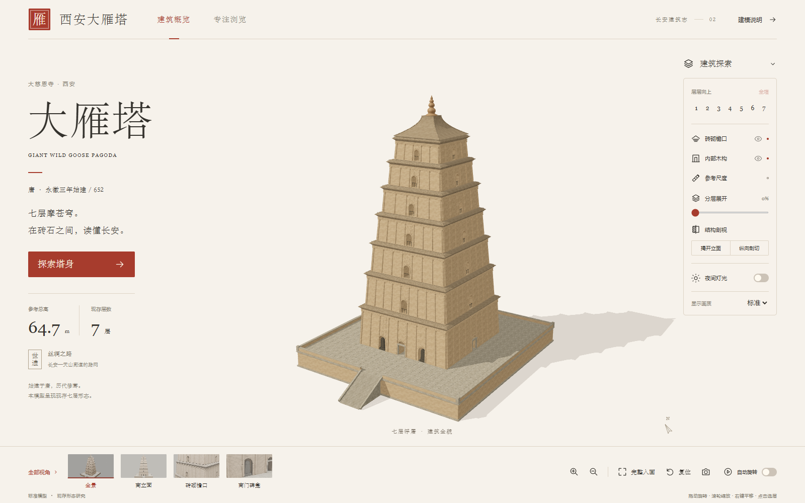
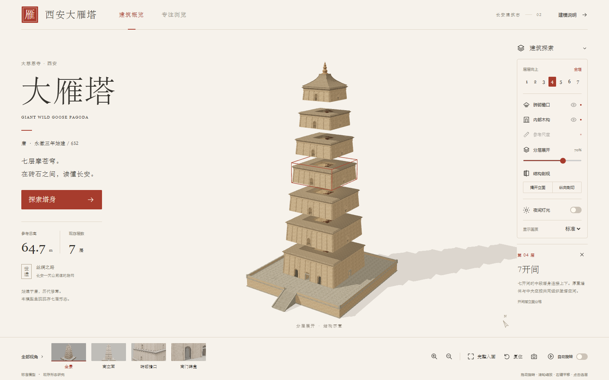
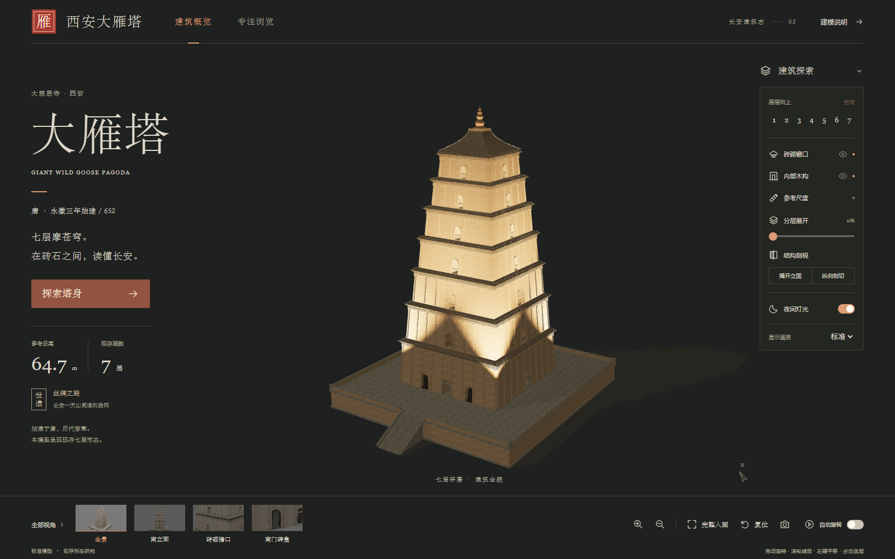
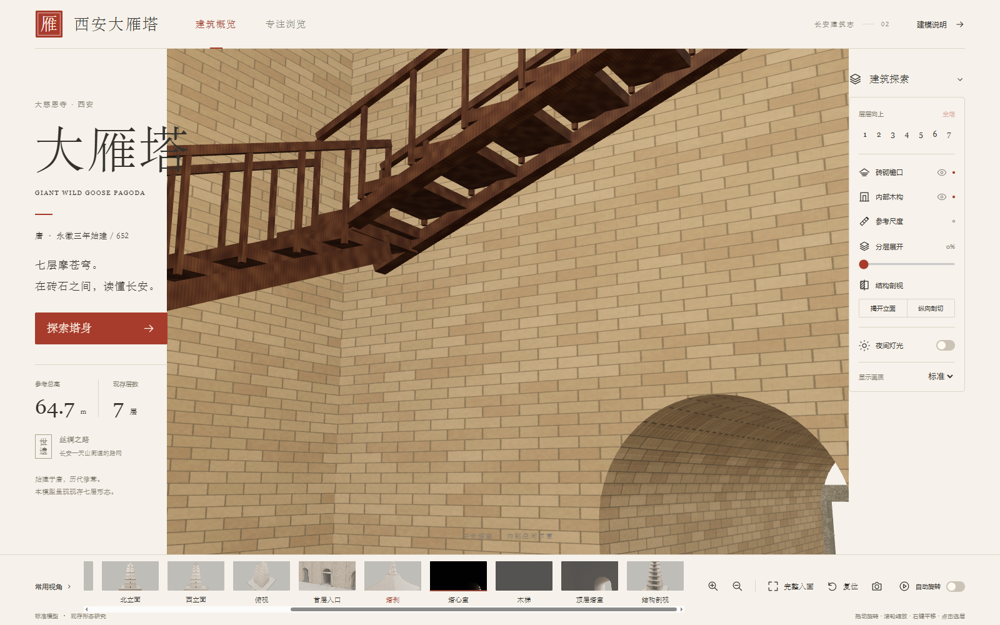

# 用 GPT-6 和 Blender，把西安大雁塔做成可探索的网页 3D 模型

一句“做一座大雁塔”很容易得到一个远看相似的外壳；这个项目想交付的，是一座可以在浏览器中观察结构、进入内部并切换展示状态的建筑模型。

项目以现存七层大雁塔为对象：从塔基平台、南侧台阶、七层收分塔身，到四面券洞、砖仿木立面、叠涩檐口、碑龛、塔刹和内部木梯，都被组织为可操作的三维构件。最终交付包含可编辑的 Blender 工程、带 PBR 贴图的 GLB，以及无需后端即可部署的交互网页。

> **在线预览：[https://demo.darmk.com.cn/xianDayanPagoda/](https://demo.darmk.com.cn/xianDayanPagoda/)**  
> 建议使用开启硬件加速的 Chrome、Edge 或 Firefox；标准模型约 8.34 MB，首次打开需要一点加载时间。

## 关注公众号引导

> 创作不易，感谢支持。  
> 扫码关注公众号，继续发掘更多精彩内容和作品。




*图 1｜同一屏中呈现建筑说明、实时模型、楼层与构件控制、预设视角。*

下面的动图由项目的 Blender 源场景输出 16 帧环绕渲染合成，展示与网页发布模型对应的大雁塔建筑主体和平台构成。

<video controls width="800">
  <source src="./assets/demo.mp4" type="video/mp4">
  你的浏览器不支持视频播放，请直接下载：<a href="./docs/20260910_163914.mp4">demo.mp4</a>
</video>

*视频｜大雁塔模型环绕展示。为便于 README 加载，动图经过缩放与调色板压缩。*

## 项目完成了什么

### 不只是外观，而是可探索的七层砖塔

模型采用米制单位，总高按约 **64.7 m** 控制，首层塔身边宽按约 **25.5 m** 控制。它不是把纹理贴在一个封闭方盒上：每层四面中央都有真实墙厚、拱腹和内壁的券洞；一、二层为九开间，三、四层为七开间，五至七层为五开间。

塔基包含铺地、南侧台阶、石门框及南面两座独立碑龛。塔身按平台、七层、塔顶和塔刹分组；每层继续划分为四个立面、檐口与内部构件，因此网页可以对真实构件进行选择、隐藏和展开。

| 项目 | 当前结果 |
| --- | --- |
| 建筑主体 | 七层收分塔身、砖砌收顶与葫芦形塔刹 |
| 结构细节 | 券洞、墙厚、砖柱、横枋、叠涩檐口、菱角牙子、碑龛与石门框 |
| 内部空间 | 中央塔室、楼板开口、各层木梯与扶手；作为研究性空间示意 |
| 模型版本 | 高清、标准、轻量三档 GLB，均保留相同构件层级 |
| 标准版规模 | 约 8.34 MB、197,930 个三角面、105 个网格、14 张内嵌贴图 |
| 验证结果 | 七层、28 个立面分组、两座碑体与总体高度契约均通过；glTF 检查无错误和警告 |

砖、石、木、檐口、碑体与塔刹使用原创 PBR 材质。贴图被嵌入 GLB，部署网页时不依赖 Blender 贴图源目录，也避免了外部贴图路径遗失的问题。

### 网页把模型变成可操作的展览

页面延续参考钟楼项目的暖纸色、宋体标题与朱砂红强调色，但针对高塔重新组织了模型构图和交互。鼠标拖动旋转，滚轮缩放，右键平移；键盘和减少动态效果偏好也得到支持。

- 14 个预设视角：全景、四立面、入口、碑龛、檐口、塔刹、塔心室、木梯、顶层和剖面等。
- 按第 1 至第 7 层选择并高亮，显示各层立面开间与简要说明。
- 控制檐口、内部结构和参考尺度；可分层展开，也可进行南立面揭开或纵向剖切。
- 日夜灯光、自动旋转、完整入画、专注浏览、PNG 截图与高 / 标准 / 轻量画质切换。
- 支持加载进度、加载失败重试；WebGL 不可用时退回到相同视角的静态渲染图。



*图 2｜分层展开保留各层真实构件关系，用于阅读高塔的层次；它是展示性状态，不代表实际拆解方式。*



*图 3｜夜景会同时调整页面、环境和建筑照明，保留砖石与檐口的层次。*

## 怎么实现：GPT-6 + Blender + WebGL

这里的重点不是让 AI 一次猜完所有历史细节，而是把需求、资料、参数、建模脚本、模型验证和网页展示连接成一条可检查的链路。

### 1. 先把自然语言需求变成边界明确的模型任务

GPT-6 协助把“大雁塔 3D 展示”拆成可以执行的规则：建筑要覆盖哪些部位，哪些尺寸是公开资料支持的，哪些内部空间只能作为推定，以及最后需要交付哪些文件。项目将信息分为有依据的现状形制与研究性示意，避免把局部推断写成测绘结论。

本次保留的关键约束包括七层、逐层收分、`9 / 9 / 7 / 7 / 5 / 5 / 5` 立面分格、四面券洞、南面双碑龛、砖仿木檐口与砖砌塔顶。总高约 64.7 m 与首层宽约 25.5 m 作为整体比例控制；逐层尺寸、壁厚、楼梯路线和部分构件则明确标注为推定范围。

GPT-6 / Codex 在流程中负责整理约束、编写与迭代脚本、分阶段驱动工具、读取验证反馈；人负责确认范围、判断资料是否充分，并决定历史细节应当复原、简化或披露为示意。

### 2. 在 Blender 中用参数和构件生成整塔

Blender 4.2 LTS 是模型生产工具，不只是导出器。项目的 [`scripts/blender/config.json`](scripts/blender/config.json) 保存随机种子、尺度与逐层参数；[`build.py`](scripts/blender/build.py) 按阶段生成平台、七层、塔顶和收尾场景。重复出现的砖柱、券砖、檐口牙子和楼梯踏步由脚本批量生成，保证同类构件的一致性，也让局部修改可以回到规则本身。

建模先确保空间关系正确，再补细节：

1. 建立塔基、七层收分体量、洞口和塔刹，先核对整体轮廓与标高。
2. 分四个立面制作带厚度的墙体和拱券，并把南面碑龛与中央通道分开处理。
3. 按每层创建砖柱、横枋、叠涩檐口、菱角牙子和砖砌收顶，使近景与仰视有真实的体积轮廓。
4. 创建中央塔室、楼板开口、环绕木梯与扶手。内部路线缺乏完整测绘资料，因此以“空间示意”而非现场复原呈现。
5. 生成砖、石、木、檐口、碑体等 PBR 贴图，打包进 `.blend` 后再导出网页模型。



*图 4｜内部采用可解释的空间示意：保留楼板、洞口与楼梯的连续关系，不虚构碑刻文字或没有可靠依据的精细雕刻。*

### 3. 让 Blender 源工程成为可再生成的资产

[`blender/dayan-pagoda.blend`](blender/dayan-pagoda.blend) 是可编辑源工程，贴图已打包；[`scripts/blender/textures.py`](scripts/blender/textures.py) 生成材质贴图，`refine.py` 整理与打包场景，`render.py` 按固定相机输出视角检查图。

生成器支持分阶段运行，例如只重建第 3 层或只完成塔顶，避免为了修一个局部而重做全部场景。采用固定随机种子与命名契约，导出的节点能够稳定保留 `Floor01` 至 `Floor07`、四立面、内部、檐口和碑体等语义，供网页交互使用。

### 4. 优化 GLB，并做格式和几何的双重验证

Blender 先导出原始 GLB，随后 [`scripts/model/optimize.mjs`](scripts/model/optimize.mjs) 使用 glTF-Transform、Sharp、MikkTSpace 与 Meshopt 完成：去重、清理退化面、重建切线、压缩 WebP 贴图，并生成高清、标准与轻量版本。

[`scripts/model/validate.mjs`](scripts/model/validate.mjs) 不只检查文件能否读取，还会使用 MeshoptDecoder 解码后再次验证，并检查：

- 是否存在非有限坐标或退化几何；
- 是否恰好保留七层与 28 个立面节点；
- 两座碑体节点是否存在；
- 模型包围盒高度是否仍为约 64.7 m。

这种验证比“能在 Blender 里看到”更可靠：网页加载的是压缩后的发布版，而不是制作过程中的原始场景。完整统计与检查结果见 [`public/model/manifest.json`](public/model/manifest.json) 和 [`docs/qa/model-validation.json`](docs/qa/model-validation.json)。

### 5. 在浏览器中实时加载、控制并安全降级

网页使用 React 19、TypeScript、Vite 8 与 Three.js。`GLTFLoader` 配合 `MeshoptDecoder` 按需加载当前选定画质的一份 GLB；初始相机根据模型真实顶点和画布比例计算入画距离，而不是写死一个固定距离。

查看器中的模型节点与 Blender 导出语义一一对应：楼层选择框取对应 `FloorXX` 包围盒，分层展开保存并偏移各层初始位置，立面揭开与剖切基于构件元数据控制；剖切另有封口网格，避免只裁掉表面后暴露空壳。页面会在画质切换时释放旧模型的几何、材质和贴图资源，降低长期浏览的资源残留风险。

最终网页是静态站点。构建后只需托管 `dist/` 内的文件；服务器不需要安装 Node.js、Blender 或数据库。详见 [`DEPLOYMENT.md`](DEPLOYMENT.md)。

## 本地运行

Windows 可直接双击根目录的 [`start.cmd`](start.cmd)，然后访问 [http://127.0.0.1:5178/](http://127.0.0.1:5178/)。它会预览已构建的 `dist`，不需要启动 Blender。

开发或重新构建页面时，项目要求 Node.js 22.13+：

```powershell
# 首次安装依赖
npm ci

# 开发服务器
.\scripts\start.ps1 -Mode dev

# TypeScript 检查并构建静态站点
.\scripts\start.ps1 -Mode build

# 预览构建成品
.\scripts\start.ps1 -Mode preview
```

也可直接使用 `npm run dev`、`npm run check`、`npm run build` 与 `npm start`。不要同时启动两个占用 5178 端口的服务；不要用 `file://` 直接打开 `dist/index.html`，因为模型和视角配置通过 HTTP 请求加载。

### 重新制作模型

环境：Blender 4.2 LTS、Python（numpy、Pillow）以及本项目的 Node 依赖。下面的 Blender 路径为本机路径，换机器时请替换为实际安装位置。

```powershell
python scripts/blender/textures.py
& 'D:\Program Files\Blender Foundation\Blender 4.2\blender.exe' --background --factory-startup --python scripts/blender/build.py -- --stage all
& 'D:\Program Files\Blender Foundation\Blender 4.2\blender.exe' --background blender/dayan-pagoda.blend --python scripts/blender/refine.py
npm run model:optimize
npm run model:validate
& 'D:\Program Files\Blender Foundation\Blender 4.2\blender.exe' --background blender/dayan-pagoda.blend --python scripts/blender/render.py
npm run check
npm run build
```

全量重建应使用 `--factory-startup`，以避免旧对象与新对象同名。Blender 导出器偶尔会提示多边形切线限制；发布前优化流程会在三角化几何上重建切线，最终以 `npm run model:validate` 的报告为准。

## 文件结构与交付物

```text
blender/
  dayan-pagoda.blend          可编辑的 Blender 源工程（贴图已打包）
  textures/                   原创 PBR 贴图源文件
scripts/blender/              参数化建模、材质、导出与视角渲染脚本
scripts/model/                GLB 优化与验证脚本
public/model/                 三档发布 GLB、视角图、相机定义与统计清单
src/                          React 页面、样式和 Three.js 查看器
docs/research/                资料来源、参数口径与推定说明
docs/qa/                      模型验证、浏览器验收记录与截图
dist/                         可直接部署的静态网站
```

主要交付包括：可编辑 Blender 工程、可再生成的脚本、PBR 贴图、三档压缩 GLB、React/Three.js 网站源码、部署产物、14 张模型视角图，以及资料依据和验收记录。

## 验证范围与表达边界

项目已在本地完成 TypeScript、静态构建、GLB 格式与解码几何、14 个预设视角、构件控制、展开/剖视互斥、异常重试、WebGL 静态降级以及桌面和手机尺寸模拟验证。标准画质在本机 1600 × 1000 的已加载全景状态下，短时采样约为 60 FPS；这不等同于所有设备、冷加载或真机表现。

这是依据公开资料制作的**建筑展示模型**，不是修缮施工模型或完整测绘复原。总高与首层宽度是参考口径；各层精确尺寸、壁厚、楼梯路线、楼板开口及部分构件属于合理推定。碑刻不伪造文字，门楣线刻和细密雕刻未复原；寺院、广场与城市环境也不在本版范围内。
